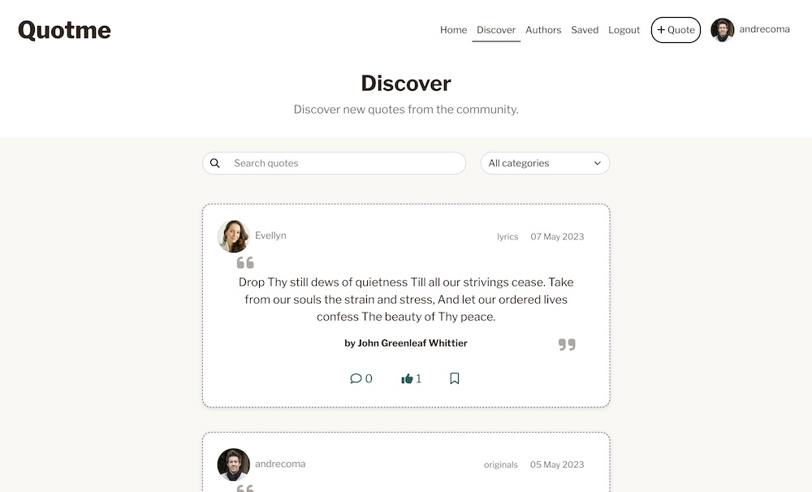

# **Quotme**

Quotme is a website developed to give users the ability to share and discover new quotes. The user can create an account, share new quotes, save and like other users quotes. The user can also follow a user to see relevant content from followers. Each user has a profile page that gives the user the possibility of writing a personal statement, add a profile image, edit the profile, change the username and password. Each quote allows the user to comment and share thoughts or show support for that quote. Each comment gives the user an option to reply to that specific comment, this allows the users to carry a conversation. The website also show to top ten most popular authors, the ones that have the most amount of quotes. When an user clicks on an author he is taken to the author page where he can view and search all quotes from that author.
The website was developed with a minimalistic and clean design goal, only showing essencial elements to give a fantastic overall user experience.
This project was developed as a Portfolio Project 5 - Advanced Front End Specialization as part of the Diploma in Full Stack Software Development from [Code Institute](https://www.codeinstitute.net).

[You can view the live website here](https://quotme.herokuapp.com)



# Table of Content

- [**Project**](#project)
    - [Objective](#objective)
    - [Site Users Goal](#site-users-goal)
    - [Site Owners Goal](#site-owners-goal)
    - [Project Management](#project-management)
- [**User Experience (UX)**](#user-experience-ux)
    - [Wireframes](#wireframes)
    - [User Stories](#user-stories)
    - [Site Structure](#site-structure)
    - [Design Choices](#design-choices)  
- [**Features**](#existing-features)
    - [Home](#home)
        - [*Home page*](#home-page)
        - [*Home feed*](#home-feed)
        - [*Navigation*](#navigation)
    - [Discover](#discover-page)
    - [Authors](#authors-page)
    - [Quote](#quote-page)
    - [Saved](#saved-page)
    - [Profile](#profile-page)
    - [Sign up](#)
    - [Login](#)


# **Project**

## Objective
The objective of this project is to create a platform for users to share, discover, like and save their favourite quotes from, books, lyrics, movies, statements, original quotes from the user and others. The website allows the user to create an account, connect with other users through following their profile, sharing quotes, commenting, replying to comments, liking and saving their favourite quotes. The website also features a search bar to make it easy for user to find what they are looking for. On top of that, the platform will feature an authors page with the top ten most popular quoted author's on the website.

## Site Users Goal
The site user can share, discover and save different quotes from the community. It serves as a platform to share content and interact throught comments and replies.

## Site Owners Goal
The site owners goal is to provide a platform for user to share their favourite quotes. The site makes it possible for users to interact with each other creating a community like atmosphere.

## Project Management

### Github Board
In order to keep everything organized I used Github's built in project board to add all the different user stories and to move them along as they we're being completed. It also allowed me to organize everything through epics and interations. This way it's easier to keep track and create a plan for implementing all the features. With this project board it also made it possible to create labels and use the MoSCoW (Must have, Should have, Could have and Won't have) approach in each interation.

<details><summary><b>Github's project management board</b></summary>


</details><br/>

### Django-REST API Backend
In order to develop this project I first developed the API backend using Django-REST Framework. More information and details of the API can be found in the [Quotme-api repository](https://github.com/andrebraga7/quotme-api)

[Back to top](#table-of-content)

# **User Experience (UX)**

## Wireframes
 All the project's wireframes were created using [Balsamiq](https://balsamiq.com). They were created with mobile first design mentality and also optimized for larger desktop screens. There are some slight differences to the final project as some design choices where changed during the development process in order to provide a better user experience.

<details><summary><b>Wireframes</b></summary>


</details><br/>

[Back to top](#table-of-content)

## User Stories
The first step for this project was to write all the epics and user stories. They were used to guide the development and were divided in seven epics: access the website, create a quote, interact with quotes, discover page, authors page, quote page and profile page. In the [testing](#testing) section I evaluate the outcome of each.

### Access the website
|   |   |
|--------|--------|
| As a user I can view a navbar so that I can navigate between pages. | &check; |
| As a user I can navigate between pages so that I can view content without page refresh. | &check; |
| As a user I can create an account so that I can have my own profile page. | &check; |
| As a user I can login to the website so I can have access to all features. | &check; |
| As a user I can stay logged in until I decide to logout so that I can have a good user experience. | &check; |
| As a logged out user I can view the signup and login options so that I can signup or login. | &check; |

[Back to top](#table-of-content)

### Create a quote
|   |   |
|--------|--------|
| As a user I can add a quote so that I can share it with the community. | &check; |
| As a user I can start typing an author of a quote so that It automatically loads available authors. | &check; |

[Back to top](#table-of-content)

### Interact with quotes
|   |   |
|--------|--------|
| As a user I can view the details of a single quote so that I can learn more about it. | &check; |
| As a user I can like a quote so that I can show my interest in a quote. | &check; |
| As a user I can save a quote so that I can view it in my saved quotes. | &check; |

[Back to top](#table-of-content)

### Discover page
|   |   |
|--------|--------|
| As a user I can view the most recent quotes so that I am up to date with the latest content. | &check; |
| As a user I can view quotes by categories so that I can view only what interests me. | &check; |
| As a user I can search for a quotes by keywords so that I can view what interest me. | &check; |

[Back to top](#table-of-content)

### Authors page
|   |   |
|--------|--------|
| As a user I can view the most popular authors so that I can view their quotes. | &check; |
| As a user I can view an authors page so that I can view all quotes related to that author.  | &check; |

[Back to top](#table-of-content)

### Quote page
|   |   |
|--------|--------|
| As a user I can view the quote page so that I can read the comments about it. | &check; |
| As a quote owner I can edit the quote title and content so that I can make corrections. | &check; |
| As a quote owner I can delete a quote so that I can remove it from the website. | &check; |
| As a user I can view a quote's comments so that I can read what users are saying. | &check; |
| As a logged in user I can create a comment in a quote so that I can share my thoughts. | &check; |
| As a logged in user I can edit a comment so that I can update the content. | &check; |
| As a logged in user I can delete a comment so that I can remove it from a quote. | &check; |
| As a user I can view a reply to a comment so that I can read what user are saying. | &check; |
| As a logged in user I can reply to a comment so that I can continue a conversations. | &check; |
| As a logged in user I can edit a reply so that I can update the content. | &check; |
| As a logged in user I can delete a reply so that I can remove it from a comment. | &check; |

[Back to top](#table-of-content)

### Profile page
|   |   |
|--------|--------|
| As a user I can view other users profiles so that I can see their quotes and learn more about them. | &check; |
| As a user I can view the statistics of a profile: number of quotes, followers, following and bio so that I can learn more about them. | &check; |
| As a user I can view all quotes by a specific user so that I can catch up on their content. | &check; |
| As a logged in user I can follow or unfollow a user so that I can view or remove quotes created by them in my feed. | &check; |
| As a logged in user I can edit my profile so that I can update my bio or profile image. | &check; |
| As a logged in user I can change my username and password so that I can change my display name and keep my account safe. | &check; |

[Back to top](#table-of-content)

## Site Structure
Quotme is divided into five distinct parts: **home page, discover, authors, quote, saved, profile and authentication**. When the page first loads and the user is logged out it takes the user to the logged out home page where it displays some headers with explanations of the webstie's features. The discover page show the user all quotes from the community. In the authors page the user can see the top ten most popular authors, ranked by number of quotes. When the user click on an authors it loads the author's page with all quotes available for that author. The quote page displays a single quote with available comments and replies underneath. In order to comment or reply to a comment the user must first login. The saved page is only displayed to logged in users, there, the user can view all quotes that are marked as saved. In the profile page, if it's the users profile, it will show the edit button with options to edit and change the profile picture. If it's another user's profile, the user can view all quotes created by that user along with: total number os quotes, followers and following. If the user is authenticated it is possible to follow or unfollow a profile. The las two pages are the authentication: sign up and login. If the user is already logged in he won't be able to visualize the login and sign up links/pages.

You can see all features in detail in the [Features](<#features>) section.

[Back to top](#table-of-content)

## Design Choices

- ### Color Scheme
Quotme is built on a minimalist design choice, so the color palette selected for this project reflects this intention. The colors where selected with the idead of linking the page with a library or book of quotes. So the colors have a beige or dark brown tone to them. To complement the scheme I choose a shade of aqua that compliments the other choices.


- ### Typography
The font used for this project was the Libre Franklin designed by Impallari Type.

- This font goes well with the design principles of relating to a book but at the same time offering good readability and aesthetics.
- Fallback font: Sans serif.

To find out more about this font, please visit the [Google Fonts website](https://fonts.google.com/specimen/Libre+Franklin).

[Back to top](#table-of-content)

# **Features**
All the project features are detailed and listed bellow:

## Home page

### Home
This is the main landing page with a top navigation menu with link to all pages and subheadings explaining the website features.

<details><summary><b>Home page logged out</b></summary>


</details><br/>

### Home Feed
When the user is authenticated, the home page displays the home feed which shows the user all quotes from followed users only.

<details><summary><b>Home feed logged in</b></summary>


</details><br/>

### Navigation
The main navigation menu has a white background with the brand on the left and navigation link to the right, which are all dark brown. The visible links change depending if a user is looged in or not and the active link has bottom border:

- If the user is logged out he can view: *home*, *discover*, *authors*, *login* and *sign up*.
- If the user is logged in he can view: *home*, *discover*, *saved*, *logout* and *profile*.
- The mobile version has the links appearing in icons with respective link names on thje bottom.

<details><summary><b>Top menu logged out</b></summary>


</details><br/>

<details><summary><b>Top menu logged in</b></summary>


</details><br/>

<details><summary><b>Mobile menu logged out</b></summary>


</details><br/>

<details><summary><b>Mobile menu logged in</b></summary>


</details><br/>

[Back to top](#table-of-content)

## Discover page

On the discover page the user can view all quotes from the community even when logged out. The page has a search bar and category selection at the top which filters the quotes by the selected keywords. The page has an infinite scroll feature that automatically loads more quotes as the user scrolls to offer a better user experience.

<details><summary><b>Discover
 page</b></summary>


</details><br/>

[Back to top](#table-of-content)

## Authors page

The authors page shows the user the top ten authors with most amount of quote count. The user can select an author and it will take him to the author page where the user can view all related quotes with that author. The page has the same functionality with a search bar an category filter.

<details><summary><b>Author page</b></summary>


</details><br/>

[Back to top](#table-of-content)

## Quote page

In the quote page the user can view specific details of a selected quotes like: comment count, likes count, comments and replies of that specific quote. If the user is the owner of the quote it shows the edit and delete options on the top right corner.

<details><summary><b>Quote page</b></summary>


</details><br/>

[Back to top](#table-of-content)

## Saved page

The saved page is only available for authenticated users and it filters all quotes saved by the user.

<details><summary><b>Saved page</b></summary>


</details><br/>

[Back to top](#table-of-content)

## Profile page

The profile page is where the user can view all profile related information, like: profile picture, quotes count, followers count, following count and all quotes created by the user. If the user is the owner of the profile and is logged he, it will display a dropdown menu with the edit and delete options.


- [**Future Features**](#future-features)

- [**Technologies Used**](#technologies-used)
    - [Languages](#languages)
    - [Frameworks & Software](#frameworks--software)
    - [Libraries](#libraries)

- [**Testing**](#testing)

- [**Deployment**](#deployment)
    - [Deployment to Heroku](#deployment-to-heroku)
    - [To Fork the Repository](#how-to-fork-the-repository-on-github)
    - [Cloning The Project](#cloning-the-project)

- [**Credits**](#credits)

- [**Acknowledgements**]()


# **Future Features**

- Add an urgency status option to jobs;
- Add an internal messaging page;
- Add a password reset page with email confirmation;
- Add more automated testing;

[Back to top](#table-of-content)

 # **Technologies used**

 ## Languages

- [HTML5](https://en.wikipedia.org/wiki/HTML) - Provides the content and structure for the website.
- [CSS3](https://en.wikipedia.org/wiki/CSS) - Provides the styling for the website.
- [JavaScript](https://en.wikipedia.org/wiki/JavaScript) - Provides interactive elements of the website
- [Python](https://en.wikipedia.org/wiki/Python_(programming_language)) - Provides the functionality for the site.

[Back to top](#table-of-content)

## Frameworks & Software
- [Bootstrap](https://getbootstrap.com/) - A CSS framework that helps building solid, responsive, mobile-first sites
- [Django](https://www.djangoproject.com/) - A model-view-template framework used to create the Review | Alliance site
- [Balsamiq](https://balsamiq.com/) - Used to create the wireframe.
- [Numbers](https://www.apple.com/uk/numbers/) - Used to create ERD models.
- [Github](https://github.com/) - Used to host and edit the website.
- [GitBash](https://en.wikipedia.org/wiki/Bash_(Unix_shell)) - Terminal in [Gitpod](https://www.gitpod.io) used to push changes to the GitHub repository.
- [Heroku](https://en.wikipedia.org/wiki/Heroku) - A cloud platform that the application is deployed to.
- [Lighthouse](https://developer.chrome.com/docs/lighthouse/overview/) - Used to test performance of site.
- [Responsive Design Checker](https://www.responsivedesignchecker.com/) - Used for responsiveness check.
- [Wave Web Accessibility Evaluation Tool](https://wave.webaim.org/) - Used to validate the sites accessibility.
- [a11y Color Contrast Accessibility Validator](https://color.a11y.com/Contrast/) - Used to test color contrast on the site
- [Real Favicon Generator](https://realfavicongenerator.net/) - Used to create the favicon.
- [Google Chrome DevTools](https://developer.chrome.com/docs/devtools/) - Used to debug and test responsiveness.
- [Cloudinary](https://cloudinary.com/) - A service that hosts all static files in the project.
- [HTML Validation](https://validator.w3.org/) - Used to validate HTML code
- [CSS Validation](https://jigsaw.w3.org/css-validator/) - Used to validate CSS code
- [PEP8 Validation](http://pep8online.com/) - At the time for deploying this project the PEP8 Online Validaton service was offline, therefore not used.
- [JSHint Validation](https://jshint.com/) - Used to validate JavaScript code

[Back to top](#table-of-content)

## Libraries

In the list below are all the libraries used in the project, these are located in *requirements.txt*:

- [asgiref](https://pypi.org/project/asgiref/) - ASGI is a standard for Python asynchronous web apps and servers to communicate with each other, and positioned as an asynchronous successor to WSGI;
- [cloudinary](https://pypi.org/project/cloudinary/) - The Cloudinary Python SDK allows you to quickly and easily integrate your application with Cloudinary. Effortlessly optimize, transform, upload and manage your cloud's assets;
- [crispy-bootstrap5](https://pypi.org/project/crispy-bootstrap5/) - Bootstrap 5 template pack for django crispy forms;
- [dj3-cloudinary-storage](https://pypi.org/project/dj3-cloudinary-storage/) - Django Cloudinary Storage is a Django package that facilitates integration with Cloudinary by implementing Django Storage API.
- [Django](https://pypi.org/project/Django/) - Django is a high-level Python web framework that encourages rapid development and clean, pragmatic design.
- [django-allauth](https://pypi.org/project/django-allauth/) - Integrated set of Django applications addressing authentication, registration, account management as well as 3rd party (social) account authentication.
- [django-crispy-forms](https://pypi.org/project/django-crispy-forms/) - Used to integrate Django DRY forms in the project.
- [gunicorn](https://pypi.org/project/gunicorn/) - Gunicorn ‘Green Unicorn’ is a Python WSGI HTTP Server for UNIX. It’s a pre-fork worker model ported from Ruby’s Unicorn project. The Gunicorn server is broadly compatible with various web frameworks, simply implemented, light on server resource usage, and fairly speedy.
- [oauthlib](https://pypi.org/project/oauthlib/) - OAuthLib is a framework which implements the logic of OAuth1 or OAuth2 without assuming a specific HTTP request object or web framework.
- [psycopg2](https://pypi.org/project/psycopg2/) - Psycopg is the most popular PostgreSQL database adapter for the Python programming language.
- [PyJWT](https://pypi.org/project/PyJWT/) - A Python implementation of RFC 7519.
- [python3-openid](https://pypi.org/project/python3-openid/) - OpenID support for modern servers and consumers.
- [pytz](https://pypi.org/project/pytz/) - This is a set of Python packages to support use of the OpenID decentralized identity system in your application, update to Python 3
- [requests-oauhlib](https://pypi.org/project/requests-oauthlib/) - Provides first-class OAuth library support for Requests.
- [sqlparse](https://pypi.org/project/sqlparse/) - sqlparse is a non-validating SQL parser for Python. It provides support for parsing, splitting and formatting SQL statements.

[Back to top](#table-of-content)

# **Testing**

Please refer to the [Testing](TESTING.md) file for more information about the testing of theMaintenanceCo.

[Back to top](#table-of-content)

# **Deployment**

## Deployment To Heroku

The project was deployed to [Heroku](https://www.heroku.com). To deploy, please follow the process below:

1. To begin with we need to create a GitHub repository from the [Code Institute template](https://github.com/Code-Institute-Org/gitpod-full-template) by following the link and then click 'Use this template'.

2. Fill in the needed details as stated in the screenshot below and then click 'Create Repository From Template'.

3. When the repository creation is done click 'Gitpod' to open the repository in the gitpod IDE.

4. Now it's time to install Django and the supporting libraries that are needed. Type the commands below to do this.

- ```pip3 install 'django<4' gunicorn```
- ```pip3 install 'dj_database_url psycopg2```
- ```pip3 install 'dj3-cloudinary-storage```

5. When Django and the libraries are installed we need to create a requirements file.

- ```pip3 freeze --local > requirements.txt``` - This will create and add required libraries to requirements.txt

6. Now it's time to create the project.

- ```django-admin startproject YOUR_PROJECT_NAME .``` - This will create your project

7. When the project is created we can now create the application.

- ```python3 manage.py startapp APP_NAME``` - This will create your application

8. Add the application to settings.py

9. Now it is time to do our first migration and run the server to test that everything works as expected. This is done by writing the commands below.

- ```python3 manage.py migrate``` - This will migrate the changes
- ```python3 manage.py runserver``` - This runs the server. To test it, click the open browser button that will be visible after the command is run.

10. Now it is time to create our application on Heroku, attach a database, prepare our environment and settings.py file and setup the Cloudinary storage for our static and media files.

- Head on to [Heroku](https://www.heroku.com/) and sign in (or create an account if needed).

- In the top right corner there is a button that is labeled 'New'. Click that and then select 'Create new app'.

11. Now it's time to enter an application name that needs to be unique. When you have chosen the name, choose your region and click 'Create app".

12. To add a database to the app you need to go to the resources tab ->> add-ons, search for 'Heroku Postgres' and add it.

13. Go to the settings tab and click on the reveal Config Vars button. Copy the text from DATABASE_URL (because we are going to need it in the next step).

14. Go back to GitPod and create a new env.py in the top level directory. Then add these rows.

- ```import os``` - This imports the os library
- ```os.environ["DATABASE_URL_FROM HEROKU"]``` - This sets the environment variables.
- ```os.environ["SECRET_KEY"]``` - Here you can choose whatever secret key you want.

15. Now we are going to head back to Heroku to add our secret key to config vars. See screenshot below.

16. Now we have some preparations to do connected to our environment and settings.py file. In the settings.py, add the following code:

```import os```

```import dj_database_url```

```if os.path.isfile("env.py"):```

```import env```

17. In the settings file, remove the insecure secret key and replace it with:

```SECRET_KEY = os.environ.get('SECRET_KEY')```

18. Now we need to comment out the old database setting in the settings.py file (this is because we are going to use the postgres database instead of the sqlite3 database).

Now, add the link to the DATABASE_URL that we added to the environment file earlier.

19. Save all your fields and migrate the changes.

```python3 manage.py migrate```

20. Now we are going to get our connection to Cloudinary connection working (this is were we will store our static files). First you need to create a Cloudinary account and from the Cloudinary dashboard copy the API Environment Variable.

21. Go back to the env.py file in Gitpod and add the Cloudinary url (it's very important that the url is correct):

```os.environ["CLOUDINARY_URL"] = "cloudinary://************************"```

22. Go back to Heroku and add the Cloudinary url in Config Vars. We also need to add a disable collectstatic variable to get our first deployment to Heroku to work.

23. In the settings.py file on Gitpod. We now need to add our Cloudinary Libraries we installed earlier to the installed apps. Here it is important to get the order correct.

24. For Django to be able to understand how to use and where to store static files we need to add some extra rows to the settings.py file.

25. Now it's time to link the file to the Heroku templates directory.

26. Let's change the templates directory to TEMPLATES_DIR in the teamplates array.

27. To be able to get the application to work through Heroku we also need to add our Heroku app and localhost to which hosts that are allowed.

28. Now we just need to add some files to Gitpod.

- Create 3 folders in the top level directory: **media**, **static**, **templates**
- Create a file called **Procfile* and add the following line of code to it: ```web: gunicorn PROJ_NAME.wsgi?```

29. Now you can save all the files and prepare for the first commit and push to Github by writing the lines below.

- ```git add .```
- ```git commit -m "Deployment Commit```
- ```git push```

30. Before moving on to the Heroku deployment we just need to add one more thing in the config vars. We need to add "PORT" in the KEY input field and "8000" in the VALUE field. If we don't add this there might be problems with the deployment.

31. Now it's time for deployment. Scroll to the top of the settings page in Heroku and click the 'Deploy' tab. For deployment method, select 'Github'. Search for the repository name you want to deploy and then click connect.

32. Scroll down to the manual deployment section and click 'Deploy Branch'. Hopefully the deployment is successful!

The link to the live theMaintenanceCo website on Heroku can be found [here](https://the-maintenance-co.herokuapp.com/). And the Github repository can be found [here](https://github.com/andrebraga7/the-maintenance-co).

[Back to top](#table-of-content)

## How To Fork The Repository On GitHub

It is possible to do a independent copy of a GitHub Repository by forking the GitHub account. The copy can then be viewed and it is also possible to do changes in the copy without affecting the original repository. To fork the repository, take these steps:

1. After logging in to GitHub, locate the repository. On the top right side of the page there is a 'Fork' button. Click on the button to create a copy of the original repository.

[Back to top](#table-of-content)

## Cloning The Project

To clone and set up this project you need to follow the steps below.

1. When you are in the repository, find the code tab and click it.
2. To the left of the green GitPod button, press the 'code' menu. There you will find a link to the repository. Click on the clipboard icon to copy the URL.
3. Use an IDE and open Git Bash. Change directory to the location where you want the cloned directory to be made.
4. Type 'git clone', and then paste the URL that you copied from GitHub. Press enter and a local clone will be created.
5. To be able to get the project to work you need to install the requirements. This can be done by using the command below:

* ```pip3 install -r requirements.txt``` - This command downloads and install all required dependencies that is stated in the requirements file.

6. The next step is to set up the environment file so that the project knows what variables that needs to be used for it to work. Environment variables are usually hidden due to sensitive information. It's very important that you don't push the env.py file to Github (this can be secured by adding env.py to the .gitignore-file). The variables that are declared in the env.py file needs to be added to the Heroku config vars. Don't forget to do necessary migrations before trying to run the server.

* ```python3 manage.py migrate``` - This will do the necessary migrations.
* ```python3 manage.py runserver``` - If everything i setup correctly the project is now live locally.

[Back to top](#table-of-content)

# **Credits**

## Content

- All text content was written by Andre Braga;

- The hero image in the landing page was generated by [Midjourney's](https://midjourney.com/home/?callbackUrl=%2Fapp%2F) AI;

- Template for read.me provided by Code Institute (*with some additional changes that my mentor [Precious Ijege](https://www.linkedin.com/in/precious-ijege-908a00168/))* suggested;

## Technical

- I used the django documentation to help me understand the framework and python concepts [Django Documentation](https://docs.djangoproject.com/en/4.1/);

- The Django Allauth documentation was really helpfull to help with the User models and login, signup pages. [Django Allauth documentation](https://django-allauth.readthedocs.io/en/latest/);

- [Stackoverflow](https://stackoverflow.com/), as always, was really helpfull with small helps and concepts explanation.

[Back to top](#table-of-content)

# Acknowledgements
TheMaintenanceCo was creates as the fourth portfolio project for the Full Stack Software Developer course from [**Code Institute**](https://codeinstitute.net). I would like to thank my mentor, [**Precious Ijege**](https://www.linkedin.com/in/precious-ijege-908a00168/) for his guidance and support throught this project and the Code Institute team.

[**Andre Braga**](https://www.linkedin.com/in/andrestrevisan/) 2023

[Back to top](#table-of-content)