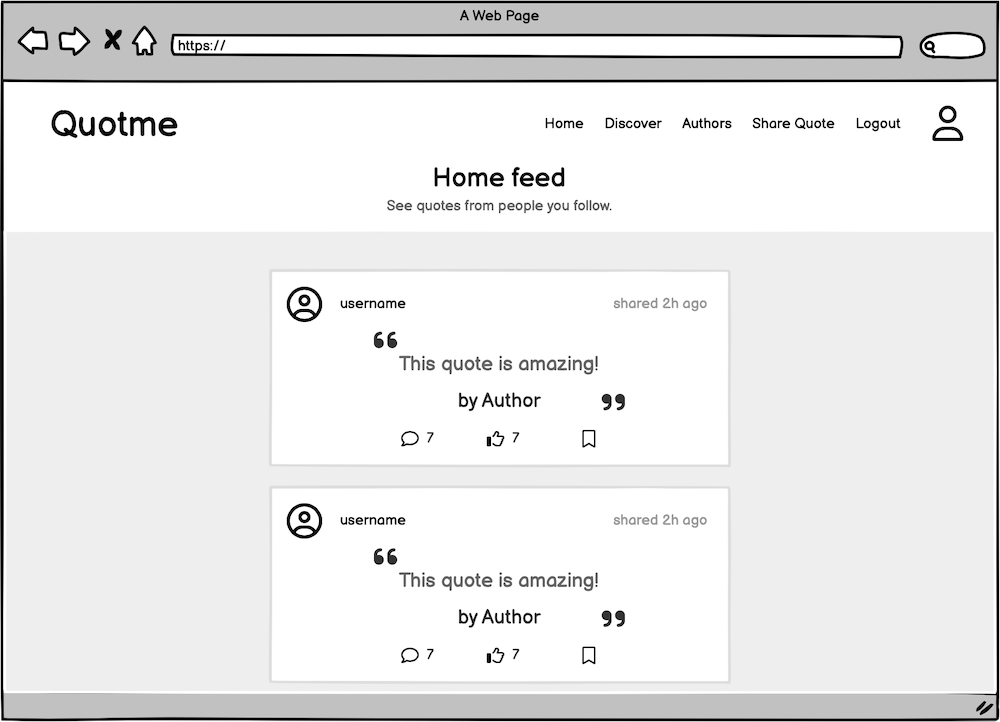

# **Quotme**

Quotme is a website developed to give users the ability to share and discover new quotes. The user can create an account, share new quotes, save and like other users quotes. The user can also follow a user to see relevant content from followers. Each user has a profile page that gives the user the possibility of writing a personal statement, add a profile image, edit the profile, change the username and password. Each quote allows the user to comment and share thoughts or show support for that quote. Each comment gives the user an option to reply to that specific comment, this allows the users to carry a conversation. The website also show to top ten most popular authors, the ones that have the most amount of quotes. When an user clicks on an author he is taken to the author page where he can view and search all quotes from that author.
The website was developed with a minimalistic and clean design goal, only showing essencial elements to give a fantastic overall user experience.
This project was developed as a Portfolio Project 5 - Advanced Front End Specialization as part of the Diploma in Full Stack Software Development from [Code Institute](https://www.codeinstitute.net).

[You can view the live website here](https://quotme.herokuapp.com)


# Table of Content

- [**Project**](#project)
    - [Objective](#objective)
    - [Site Users Goal](#site-users-goal)
    - [Site Owners Goal](#site-owners-goal)
    - [Project Management](#project-management)
- [**User Experience (UX)**](#user-experience-ux)
    - [Wireframes](#wireframes)
    - [User Stories](#user-stories)
    - [Site Structure](#site-structure)
    - [Design Choices](#design-choices)  
- [**Features**](#existing-features)
    - [Home](#home)
        - [*Home page*](#home-page)
        - [*Home feed*](#home-feed)
        - [*Navigation*](#navigation)
    - [Discover](#discover-page)
    - [Authors](#authors-page)
    - [Quote](#quote-page)
        - [*Comment*](#comment)
        - [*Reply*](#reply)
    - [Saved](#saved-page)
    - [Profile](#profile-page)
    - [Sign up](#sign-up-page)
    - [Login](#login-page)
    - [404 - Not found](#404---not-found)    
- [**Future Features**](#future-features)
- [**Technologies Used**](#technologies-used)
    - [Languages](#languages)
    - [Frameworks & Software](#frameworks--software)
    - [Libraries](#libraries)
- [**Testing**](#testing)
- [**Deployment**](#deployment)
    - [Deployment to Heroku](#deployment-to-heroku)
    - [To Fork the Repository](#how-to-fork-the-repository-on-github)
    - [Cloning The Project](#cloning-the-project)
- [**Credits**](#credits)
- [**Acknowledgements**](#acknowledgements)

# **Project**

## Objective
The objective of this project is to create a platform for users to share, discover, like and save their favourite quotes from, books, lyrics, movies, statements, original quotes from the user and others. The website allows the user to create an account, connect with other users through following their profile, sharing quotes, commenting, replying to comments, liking and saving their favourite quotes. The website also features a search bar to make it easy for user to find what they are looking for. On top of that, the platform will feature an authors page with the top ten most popular quoted author's on the website.

## Site Users Goal
The site user can share, discover and save different quotes from the community. It serves as a platform to share content and interact throught comments and replies.

## Site Owners Goal
The site owners goal is to provide a platform for user to share their favourite quotes. The site makes it possible for users to interact with each other creating a community like atmosphere.

## Project Management

### Github Board
In order to keep everything organized I used Github's built in project board to add all the different user stories and to move them along as they we're being completed. It also allowed me to organize everything through epics and interations. This way it's easier to keep track and create a plan for implementing all the features. With this project board it also made it possible to create labels and use the MoSCoW (Must have, Should have, Could have and Won't have) approach in each interation.

<details><summary><b>Github's project management board</b></summary>


</details><br/>

### Django-REST API Backend
In order to create this project I first developed the API backend using Django-REST Framework. More information and details of the API can be found in the [Quotme-api repository](https://github.com/andrebraga7/quotme-api)

[Back to top](#table-of-content)

# **User Experience (UX)**

## Wireframes
 All the project's wireframes were created using [Balsamiq](https://balsamiq.com). They were created with mobile first design mentality and also optimized for larger desktop screens. There are some slight differences to the final project as some design choices where changed during the development process in order to provide a better user experience.

<details><summary><b>Wireframes</b></summary>




</details><br/>

[Back to top](#table-of-content)

## User Stories
The first step for this project was to write all the epics and user stories. They were used to guide the development and were divided in seven epics: access the website, create a quote, interact with quotes, discover page, authors page, quote page and profile page. In the [testing](#testing) section I evaluate the outcome of each.

### Access the website
|   |   |
|--------|--------|
| As a user I can view a navbar so that I can navigate between pages. | &check; |
| As a user I can navigate between pages so that I can view content without page refresh. | &check; |
| As a user I can create an account so that I can have my own profile page. | &check; |
| As a user I can login to the website so I can have access to all features. | &check; |
| As a user I can stay logged in until I decide to logout so that I can have a good user experience. | &check; |
| As a logged out user I can view the signup and login options so that I can signup or login. | &check; |

[Back to top](#table-of-content)

### Create a quote
|   |   |
|--------|--------|
| As a user I can add a quote so that I can share it with the community. | &check; |
| As a user I can start typing an author of a quote so that It automatically loads available authors. | &check; |

[Back to top](#table-of-content)

### Interact with quotes
|   |   |
|--------|--------|
| As a user I can view the details of a single quote so that I can learn more about it. | &check; |
| As a user I can like a quote so that I can show my interest in a quote. | &check; |
| As a user I can save a quote so that I can view it in my saved quotes. | &check; |

[Back to top](#table-of-content)

### Discover page
|   |   |
|--------|--------|
| As a user I can view the most recent quotes so that I am up to date with the latest content. | &check; |
| As a user I can view quotes by categories so that I can view only what interests me. | &check; |
| As a user I can search for a quotes by keywords so that I can view what interest me. | &check; |

[Back to top](#table-of-content)

### Authors page
|   |   |
|--------|--------|
| As a user I can view the most popular authors so that I can view their quotes. | &check; |
| As a user I can view an authors page so that I can view all quotes related to that author.  | &check; |

[Back to top](#table-of-content)

### Quote page
|   |   |
|--------|--------|
| As a user I can view the quote page so that I can read the comments about it. | &check; |
| As a quote owner I can edit the quote title and content so that I can make corrections. | &check; |
| As a quote owner I can delete a quote so that I can remove it from the website. | &check; |
| As a user I can view a quote's comments so that I can read what users are saying. | &check; |
| As a logged in user I can create a comment in a quote so that I can share my thoughts. | &check; |
| As a logged in user I can edit a comment so that I can update the content. | &check; |
| As a logged in user I can delete a comment so that I can remove it from a quote. | &check; |
| As a user I can view a reply to a comment so that I can read what user are saying. | &check; |
| As a logged in user I can reply to a comment so that I can continue a conversations. | &check; |
| As a logged in user I can edit a reply so that I can update the content. | &check; |
| As a logged in user I can delete a reply so that I can remove it from a comment. | &check; |

[Back to top](#table-of-content)

### Profile page
|   |   |
|--------|--------|
| As a user I can view other users profiles so that I can see their quotes and learn more about them. | &check; |
| As a user I can view the statistics of a profile: number of quotes, followers, following and bio so that I can learn more about them. | &check; |
| As a user I can view all quotes by a specific user so that I can catch up on their content. | &check; |
| As a logged in user I can follow or unfollow a user so that I can view or remove quotes created by them in my feed. | &check; |
| As a logged in user I can edit my profile so that I can update my bio or profile image. | &check; |
| As a logged in user I can change my username and password so that I can change my display name and keep my account safe. | &check; |

[Back to top](#table-of-content)

## Site Structure
Quotme is divided into five distinct parts: **home page, discover, authors, quote, saved, profile and authentication**. When the page first loads and the user is logged out it takes the user to the logged out home page where it displays some headers with explanations of the webstie's features. The discover page show the user all quotes from the community. In the authors page the user can see the top ten most popular authors, ranked by number of quotes. When the user click on an authors it loads the author's page with all quotes available for that author. The quote page displays a single quote with available comments and replies underneath. In order to comment or reply to a comment the user must first login. The saved page is only displayed to logged in users, there, the user can view all quotes that are marked as saved. In the profile page, if it's the users profile, it will show the edit button with options to edit and change the profile picture. If it's another user's profile, the user can view all quotes created by that user along with: total number os quotes, followers and following. If the user is authenticated it is possible to follow or unfollow a profile. The las two pages are the authentication: sign up and login. If the user is already logged in he won't be able to visualize the login and sign up links/pages.

You can see all features in detail in the [Features](<#features>) section.

[Back to top](#table-of-content)

## Design Choices

- ### Color Scheme
Quotme is built on a minimalist design choice, so the color palette selected for this project reflects this intention. The colors where selected with the idead of linking the page with a library or book of quotes. So the colors have a beige or dark brown tone to them. To complement the scheme I choose a shade of aqua that compliments the other choices.


- ### Typography
The font used for this project was the Libre Franklin designed by Impallari Type.

- This font goes well with the design principles of relating to a book but at the same time offering good readability and aesthetics.
- Fallback font: Sans serif.

To find out more about this font, please visit the [Google Fonts website](https://fonts.google.com/specimen/Libre+Franklin).

[Back to top](#table-of-content)

# **Features**
All the project features are detailed and listed bellow:

## Home page

### Home
This is the main landing page with a top navigation menu with link to all pages and subheadings explaining the website features.

<details><summary><b>Home page logged out</b></summary>


</details><br/>

### Home Feed
When the user is authenticated, the home page displays the home feed which shows the user all quotes from followed users only.

<details><summary><b>Home feed logged in</b></summary>


</details><br/>

### Navigation
The main navigation menu has a white background with the brand on the left and navigation link to the right, which are all dark brown. The visible links change depending if a user is looged in or not and the active link has bottom border:

- If the user is logged out he can view: *home*, *discover*, *authors*, *login* and *sign up*.
- If the user is logged in he can view: *home*, *discover*, *saved*, *logout* and *profile*.
- The mobile version has the links appearing in icons with respective link names on thje bottom.

<details><summary><b>Top menu logged out</b></summary>


</details><br/>

<details><summary><b>Top menu logged in</b></summary>


</details><br/>

<details><summary><b>Mobile menu logged out</b></summary>


</details><br/>

<details><summary><b>Mobile menu logged in</b></summary>


</details><br/>

[Back to top](#table-of-content)

## Discover page

On the discover page the user can view all quotes from the community even when logged out. The page has a search bar and category selection at the top which filters the quotes by the selected keywords. The page has an infinite scroll feature that automatically loads more quotes as the user scrolls to offer a better user experience.

<details><summary><b>Discover
 page</b></summary>


</details><br/>

[Back to top](#table-of-content)

## Authors page

The authors page shows the user the top ten authors with most amount of quote count. The user can select an author and it will take him to the author page where the user can view all related quotes with that author. The page has the same functionality with a search bar an category filter.

<details><summary><b>Author page</b></summary>


</details><br/>

[Back to top](#table-of-content)

## Quote page

In the quote page the user can view specific details of a selected quotes like: comment count, likes count, comments and replies of that specific quote. If the user is the owner of the quote it shows the edit and delete options on the top right corner.

<details><summary><b>Quote page</b></summary>


</details><br/>

### Comment

The comment component is where the user can view all comments made for the quote. In order to leave a comment the user must be logged in. If the user is the owner he can edit or delete the comment.

<details><summary><b>Comment</b></summary>


</details><br/>

### Reply

The reply component allows the user to reply to a single comment. Any replies will appear underneath the comment in an indent style. On the bottom of the comment the user can view the number of replies a comment has and if authenticated can click the *reply* button to leave a reply. If the user is the owner he can edit or delete the reply.

<details><summary><b>Reply</b></summary>


</details><br/>

[Back to top](#table-of-content)

## Saved page

The saved page is only available for authenticated users and it filters all quotes saved by the user.

<details><summary><b>Saved page</b></summary>


</details><br/>

[Back to top](#table-of-content)

## Profile page

The profile page is where the user can view all profile related information, like: profile picture, quotes count, followers count, following count and all quotes created by the user. If the user is the owner of the profile and is logged he, it will display a dropdown menu with the edit and delete options.
- If the user is authenticated and doesn't follow the profile, the follow button is visisble;
- If the user is authenticated but already follows the profile, then the unfollow button is visible;
- The user is not able to follow his own profile.

<details><summary><b>Owner profile page</b></summary>


</details><br/>

<details><summary><b>Profile edit page</b></summary>


</details><br/>

<details><summary><b>User profile page</b></summary>


</details><br/>

<details><summary><b>Unfollow profile</b></summary>


</details><br/>

[Back to top](#table-of-content)

## Sign up page

This is where the user can create an account. The username must have between 5 and 15 characters long alhanumeric underline and @ are allowed characters and must contain at least one alphabet character.

<details><summary><b>Sign up</b></summary>


</details><br/>

[Back to top](#table-of-content)

## Login page

The loggin page has a form with username and password inputs. If the information provided by the user is correct, the user is redirected to the last visited page.

<details><summary><b>Login</b></summary>


</details><br/>

[Back to top](#table-of-content)

## 404 - Not found

The page that is displayed when the router cannot find the requested url or page.

<details><summary><b>404 - Not found</b></summary>


</details><br/>

[Back to top](#table-of-content)

# **Future Features**

- Add an internal messaging page;
- Add a password reset page with email confirmation;
- Add social sign in to the loggin and sign up pages;
- Add more automated testing;

[Back to top](#table-of-content)

 # **Technologies used**

 ## Languages

- [HTML5](https://en.wikipedia.org/wiki/HTML) - Provides the content and structure for the website.
- [CSS3](https://en.wikipedia.org/wiki/CSS) - Provides the styling for the website.
- [JavaScript ES6](https://en.wikipedia.org/wiki/JavaScript) - Provides interactive elements of the website

[Back to top](#table-of-content)

## Frameworks & Software
- [React](https://react.dev/) - A front end framework. React lets you build user interfaces out of individual pieces called components;
- [React-Bootstrap](https://react-bootstrap.github.io/) - A CSS framework that helps building solid, responsive, mobile-first sites;
- [Balsamiq](https://balsamiq.com/) - Used to create the wireframe;
- [Github](https://github.com/) - Used to host and edit the website;
- [Gitpod](https://www.gitpod.io) used to push changes to the GitHub repository;
- [GitBash](https://en.wikipedia.org/wiki/Bash_(Unix_shell)) - Terminal in gitpod;
- [Heroku](https://en.wikipedia.org/wiki/Heroku) - A cloud platform that the application is deployed to;
- [Lighthouse](https://developer.chrome.com/docs/lighthouse/overview/) - Used to test performance of site;
- [Responsive Design Checker](https://www.responsivedesignchecker.com/) - Used for responsiveness check;
- [Real Favicon Generator](https://realfavicongenerator.net/) - Used to create the favicon;
- [Google Chrome DevTools](https://developer.chrome.com/docs/devtools/) - Used to debug and test responsiveness;
- [Cloudinary](https://cloudinary.com/) - A service that hosts all static files in the project;
- [HTML Validation](https://validator.w3.org/) - Used to validate HTML code;
- [CSS Validation](https://jigsaw.w3.org/css-validator/) - Used to validate CSS code;
- [JSHint Validation](https://jshint.com/) - Used to validate JavaScript code.

[Back to top](#table-of-content)

## Libraries

In the list below are all the libraries used in the project, these are located in *package.json*:

- [axios](https://axios-http.com/) - Promise based HTTP client for the browser and node.js;
- [jwt-decode](https://github.com/auth0/jwt-decode#readme) - jwt-decode is a small browser library that helps decoding JWTs token which are Base64Url encoded;
- [react-infinite-scroll-component](https://github.com/ankeetmaini/react-infinite-scroll-component#readme) - An infinite-scroll that actually works and super-simple to integrate!;
- [react-router-dom](https://reactrouter.com/en/main) - React Router is a lightweight, fully-featured routing library for the React JavaScript library.

[Back to top](#table-of-content)

# **Testing**

Please refer to the [Testing](TESTING.md) file for more information about the testing of Quotme.

[Back to top](#table-of-content)

# **Deployment**

## Deployment To Heroku

The project was deployed to [Heroku](https://www.heroku.com). To deploy, please follow the steps below:

1. Navigate to your [Heroku dashboard](https://dashboard.heroku.com/apps).

2. Click "New" and select "Create new app".


3. Input a meaningful name for your app and choose the region best suited to your location.


4. Select "Deploy" from the tabs.


5. Select "GitHub - Connect to GitHub" from deployment methods.


6. Click "Connect to GitHub" in the created section.


7. Search for the GitHub repository by name.

8. Click to connect to the relevant repo.

9. Either click `Enable Automatic Deploys` for automatic deploys or `Deploy  Branch` to deploy manually. Manually deployed branches will need re-deploying each time the repo is updated.


10. Click `View` to view the deployed site.


[Back to top](#table-of-content)

## How To Fork The Repository On GitHub

It is possible to do a independent copy of a GitHub Repository by forking the GitHub account. The copy can then be viewed and it is also possible to do changes in the copy without affecting the original repository. To fork the repository, take these steps:

1. After logging in to GitHub, locate the repository. On the top right side of the page there is a 'Fork' button. Click on the button to create a copy of the original repository.

[Back to top](#table-of-content)

## Cloning The Project

To clone and set up this project you need to follow the steps below.

1. When you are in the repository, find the code tab and click it.
2. To the left of the green GitPod button, press the 'code' menu. There you will find a link to the repository. Click on the clipboard icon to copy the URL.
3. Use an IDE and open Git Bash. Change directory to the location where you want the cloned directory to be made.
4. Type 'git clone', and then paste the URL that you copied from GitHub. Press enter and a local clone will be created.
5. To be able to get the project to work you need to install the requirements. This can be done by using the command below:
* ```npm install``` - This command downloads and install all required dependencies that is stated in the package.json file.

[Back to top](#table-of-content)

# **Credits**

## Content

- GoogleFonts, Libre Franklin [GoogleFonts](https://fonts.google.com/specimen/Libre+Franklin);

- Template for read.me provided by Code Institute (*with some additional changes that my mentor [Antonio Rodriguez](https://www.linkedin.com/in/antonio-rodr%C3%ADguez-bb9b99b7/))* suggested;

## Technical

- I used the React-Bootstrap documentation to help me understand the library [React-Bootstrap](https://react-bootstrap.github.io/getting-started/introduction/);

- [Stackoverflow](https://stackoverflow.com/), as always, was really helpfull with small helps and concepts explanation.

[Back to top](#table-of-content)

# Acknowledgements
Quotme was creates as the fifth portfolio project for the Full Stack Software Developer course from [**Code Institute**](https://codeinstitute.net). I would like to thank my mentor, [**Antonio Rodriguez**](https://www.linkedin.com/in/antonio-rodr%C3%ADguez-bb9b99b7/) for his guidance and support throught this project and the Code Institute team.

I would also like to thank the most important person that helped me throughout the entire course, my wife Evellyn. She has helped me through the dificult times and encouraged me to carry on. Here we are, te amo!

[**Andre Braga**](https://www.linkedin.com/in/andrestrevisan/) 2023

[Back to top](#table-of-content)